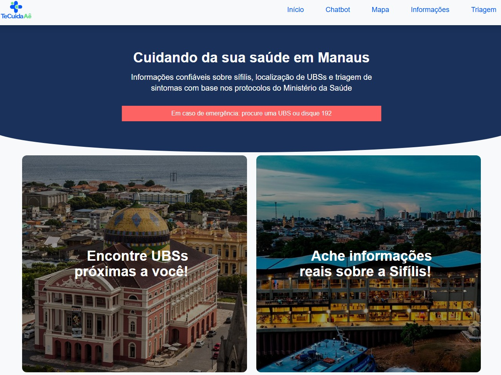
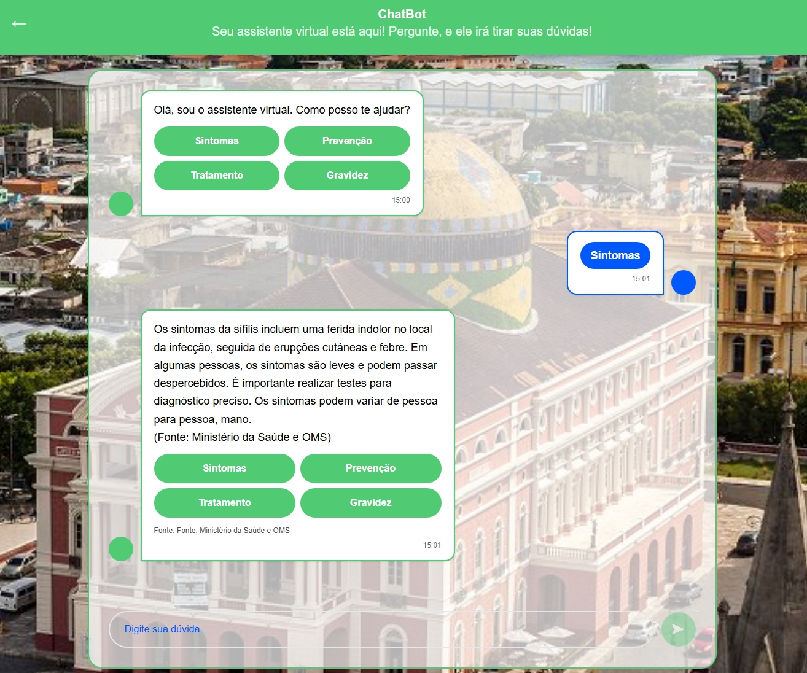
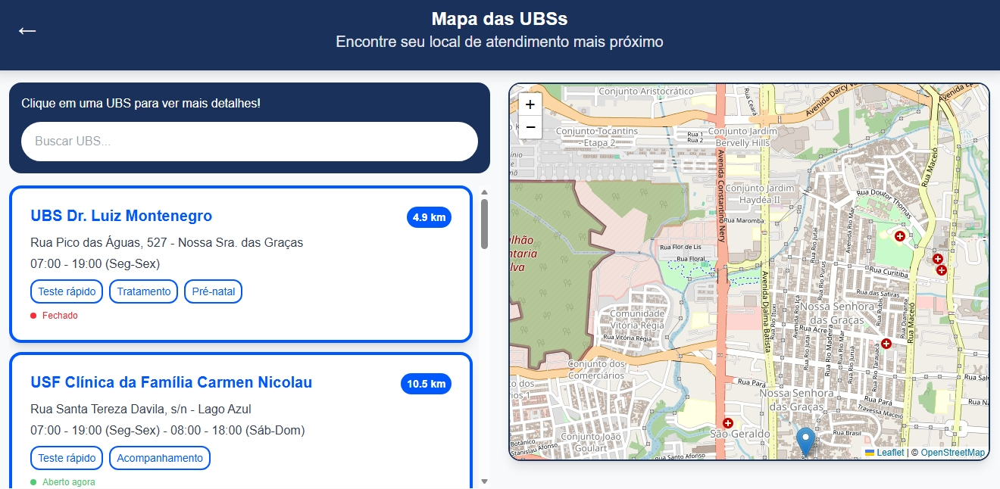
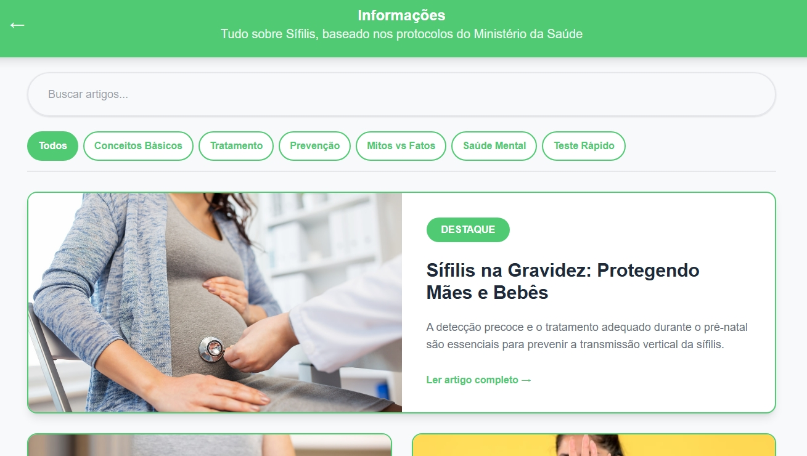
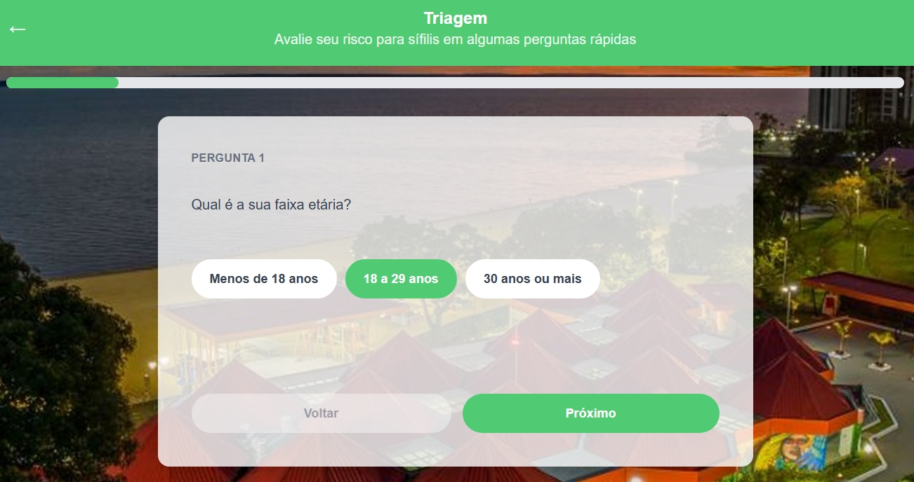

# TeCuidaAÊ
### Plataforma Web integrada com Chatbot Inteligente para acesso à informações sobre Sífilis na cidade de Manaus
# [🌐 Acesse o site TeCuidaAÊ](https://tecuidaae.vercel.app)

---
## 📖 Sobre o Projeto

O **TeCuidaAÊ** é uma plataforma web desenvolvida para combater a desinformação sobre sífilis na cidade de Manaus, especialmente entre jovens de 15 a 29 anos.

A plataforma oferece:
-  **Chatbot inteligente** com IA (Groq/LLaMA) para tirar dúvidas sobre sífilis.
-  **Mapa interativo** com localização de UBSs próximas ao usuário.
-  **Sistema de triagem** de risco com orientações personalizadas.
-  **Biblioteca de artigos** validados sobre prevenção e tratamento.
-  **Geolocalização** em tempo real com cálculo de distância.

> Projeto desenvolvido como Trabalho de Conclusão de Curso.

---

## 🖼️ Telas do Sistema

### [Tela Principal]
<!-- Adicionar screenshot da Home aqui -->


### [Tela Chatbot]
<!-- Adicionar screenshot do Chatbot aqui -->


### [Tela Mapa de UBSs]
<!-- Adicionar screenshot do Mapa aqui -->


### [Tela Informações]
<!-- Adicionar screenshot de Informações aqui -->


### [Tela Triagem de Risco]
<!-- Adicionar screenshot da Triagem aqui -->


---

## 🎥 Demo

<!-- Adicionar vídeo demo aqui -->
> 🎬 *Vídeo demo em breve*

---

## ✨ Funcionalidades

-  Chatbot com IA (Groq/LLaMA 3.3 70B) especializado em sífilis.
-  Reconhecimento de gírias e regionalismos de Manaus.
-  Mapa interativo com UBSs de Manaus.
-  Geolocalização em tempo real com cálculo de distância.
-  Sistema de triagem com 8 perguntas e 3 níveis de risco.
-  Aviso especial para menores de 18 anos com sintomas graves.
-  Biblioteca com 8 artigos sobre sífilis.
-  Interface responsiva para mobile e desktop.
-  Banco de dados PostgreSQL (Neon) para persistência de dados.

---


## 🧩 Estrutura do Projeto

```
tecuidaae-react/
├── client/
│   ├── src/
│   │   ├── assets/          # Imagens e fontes
│   │   ├── components/      # Componentes reutilizáveis
│   │   ├── hooks/           # Hooks customizados (DB)
│   │   ├── pages/           # Páginas da aplicação
│   │   │   ├── Home.tsx
│   │   │   ├── Chatbot.tsx
│   │   │   ├── Mapa.tsx
│   │   │   ├── Informacoes.tsx
│   │   │   └── Triagem.tsx
│   │   └── index.css        # Estilos globais
├── api/                     # API Vercel (serverless)
├── server/                  # Configuração do banco
└── README.md
```

---

## 🛠️ Tecnologias Utilizadas

| Tecnologia | Uso |
|---|---|
| React 19 + TypeScript | Interface do usuário |
| Vite | Build e desenvolvimento |
| Tailwind CSS | Estilização |
| Groq API (LLaMA 3.3 70B) | Chatbot inteligente |
| Leaflet + React-Leaflet | Mapa interativo |
| PostgreSQL (Neon) | Banco de dados |
| Drizzle ORM | Integração com banco |
| Vercel | Deploy e hospedagem |
| Wouter | Roteamento |

---

## 🚀 Como Rodar Localmente

## Pré-requisitos
- Node.js 18+
- npm ou pnpm

## Passo a passo

1. Clone o repositório
  ```bash
git clone https://github.com/LuizMougraby/tecuidaae-react.git
  ```
2. Entre na pasta
cd tecuidaae-react

3. Instale as dependências
npm install

4. Rode o projeto
npm run dev

Acesse http://localhost:3000 no navegador.

---

## 👥 Equipe

|Nome|GitHub|
|:---|:---|
|Amanda dos Santos Rabelo|[amandarbl](https://github.com/amandrbl)|
|José Luis da Silva Almeida|[Jose-Luiz7](https://github.com/Jose-Luis7)|
|Luiz Carlos da Silva Mougraby|[LuizMougraby](https://github.com/LuizMougraby)|
|Ryan Martins de Sousa|[Ryan-Sous](https://github.com/Ryan-Sous)|
|Samuel Cavalcante Mendes|-|

---

## 👩‍🏫 Orientadora
[Luana leal](https://github.com/ProfaLuanaLeal)

---

Feito com ❤️ para a saúde pública de Manaus 🌿
